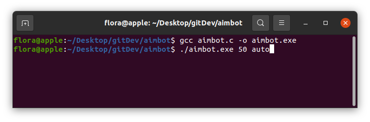

colorblind-aimbot

The tool that will make your opponents hate you.

Description:
    An aimbot designed as a color-detection 
    tool to target opponents in first person
    style shooter games. 

    Users can set instructions via command-line 

    (Also See Source Code Compiling Instructions)

Disclaimer:
    Intended for demonstration purposes only.
    Cheating in games is morally corrupt.

Source Code Compiling Instructions:
    gcc aimbot.c -o aimbot.exe

    

    For manual mode:
    User may only include a numeric first argument
    to set shots per minute.

    User may also include an optional 2nd argument "auto"
    to enable auto-shooting mode.