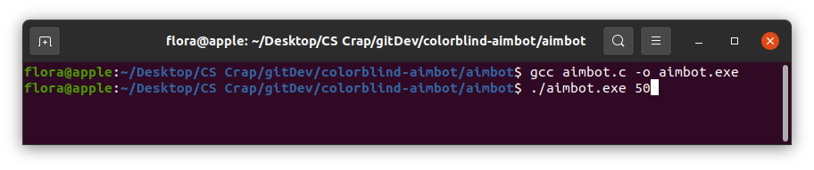

The tool that will make your opponents hate you. It's an aimbot designed as a color-detection tool to help target opponents in first person style shooter games.Users can set instructions via command-line.

    gcc aimbot.c -o aimbot.exe
    ./aimbot 50 

For auto-shooting mode, user may specify an argument to specify shots per minute. Otherwise, user enters manual-mode by default.

Disclaimer: Intended for demonstration purposes only. Cheating in games is morally corrupt.